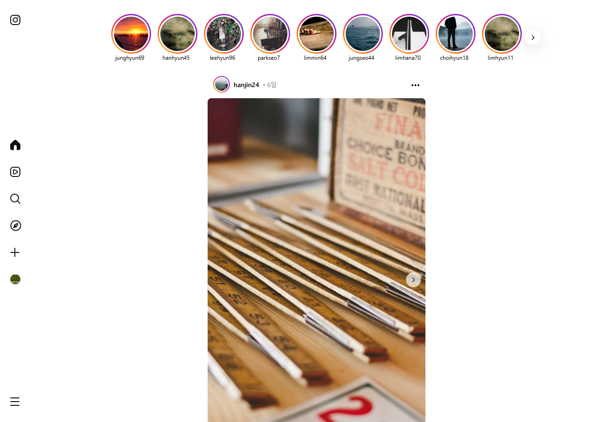
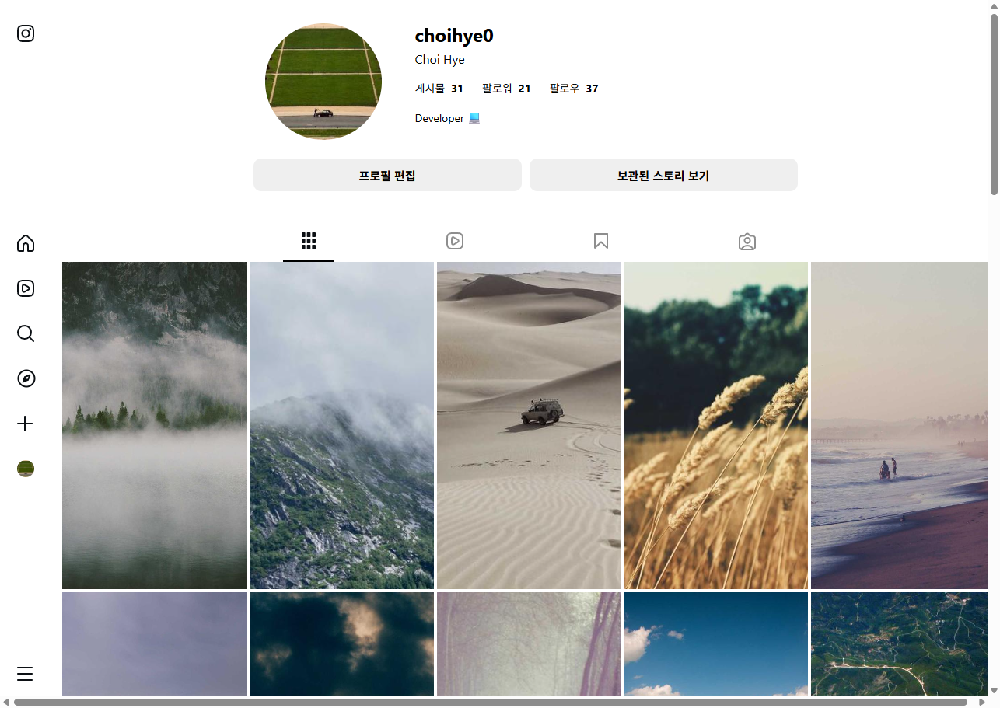
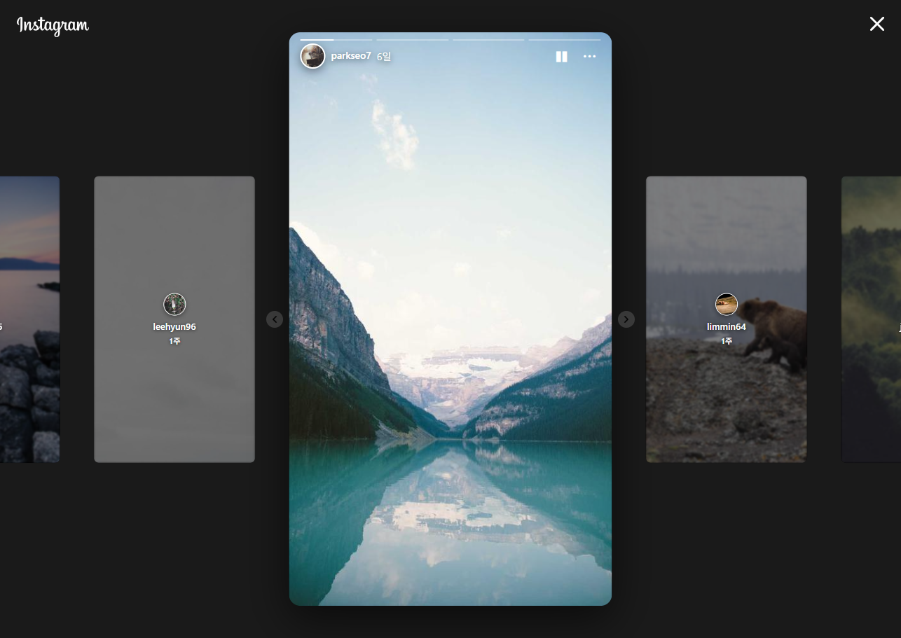

# 📸 Instagram Clone

React를 기반으로 Instagram의 주요 기능을 구현한 클론 프로젝트입니다.  
사용자 인증, 피드, 좋아요, 댓글, 스토리, 팔로우 등 SNS의 핵심 기능을 포함하며, Firebase를 활용한 이미지 업로드 및 데이터 저장 기능을 제공합니다.

## 🚀 Demo

- 🔗 Live Demo: (배포 링크 입력)

## 📁 Repository

- 🔗 GitHub: https://github.com/akak4456/instagram-clone

---

## 🛠️ Tech Stack

### Frontend

- **React**
- **JavaScript (ES6+)**
- **Styled-components**
- **React Router**

### Backend & Services

- **Firebase Storage**

### State Management

- **React Context API**

### 기타

- **LocalStorage** (Mock 데이터 관리)
- **Intersection Observer** (무한 스크롤)

---

## ✨ 주요 기능

### 👤 인증 (Authentication)

- 회원가입 및 로그인
- 사용자 정보 관리
- 간단한 인증 상태 유지

### 📰 피드 (Feed)

- 팔로우한 사용자의 게시물 조회
- 무한 스크롤을 통한 게시물 로딩
- 게시물 생성 및 이미지 업로드

### ❤️ 좋아요 & 🔖 북마크

- 게시물 좋아요 및 취소
- 북마크 추가 및 제거

### 💬 댓글 (Comments)

- 댓글 작성 및 조회
- 댓글 좋아요 기능

### 👥 팔로우 (Follow)

- 사용자 팔로우 및 언팔로우
- 팔로워/팔로잉 목록 조회 및 관리

### 📚 스토리 (Stories)

- 팔로우한 사용자의 최신 게시물을 스토리 형태로 표시
- 자동 재생 및 진행 바
- 일시정지/재생 기능

### 🔍 검색 (Search)

- 사용자 ID 및 Username 기반 검색
- 최근 검색 기록 관리

### 👤 프로필 (Profile)

- 사용자 정보 표시
- 게시물, 저장된 게시물, 태그된 게시물 조회

---

## 📂 프로젝트 구조

instagram-clone/ <br>
├── public/ # 정적 파일 <br>
├── src/ <br>
│ ├── assets/ # 이미지 및 정적 리소스 <br>
│ ├── components/ # 재사용 가능한 UI 컴포넌트 <br>
│ ├── contexts/ # 전역 상태 관리 (React Context API) <br>
│ ├── hooks/ # 커스텀 훅 <br>
│ ├── pages/ # 페이지 단위 컴포넌트 <br>
│ ├── services/ # API 호출 및 Firebase 로직 <br>
│ ├── styles/ # styled-components 스타일 정의 <br>
│ ├── utils/ # 유틸리티 함수 <br>
│ ├── App.jsx # 애플리케이션 라우팅 및 최상위 컴포넌트 <br>
│ └── main.jsx # 애플리케이션 진입점 <br>
├── .gitignore # Git 추적 제외 파일 <br>
├── index.html # HTML 템플릿 <br>
├── package.json # 프로젝트 의존성 및 스크립트 <br>
└── README.md # 프로젝트 문서

---

## ⚙️ 시작하기 (Getting Started)

### 1️⃣ 저장소 클론

```bash
git clone https://github.com/akak4456/instagram-clone.git
cd instagram-clone
```

### 2️⃣ 의존성 설치

```bash
npm install
```

### 3️⃣ 개발 서버 실행

```bash
npm run dev
```

### 4️⃣ 빌드

```bash
npm run build
```

## 주요 화면




